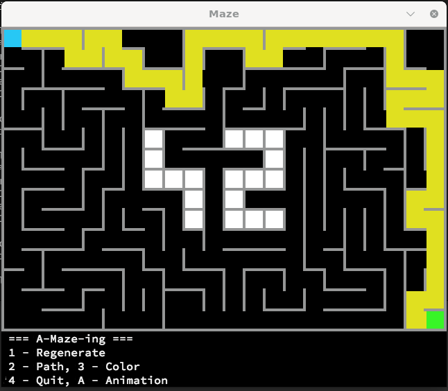

*This project has been created as part of the 42 curriculum by obachuri and jtruckse.*

---

# A-Maze-ing

This project is part of the 42.fr curriculum.

The task: 
- Create 2d maze with thin wall, 
- Place the "42" pattern in the maze,
- Find the shortest path between enter and exit,
- Show the maze and the shortest path,
- Write the maze and the path in a file. 

Bonus part: 
- Animate maze creation process
- Implement several algorithms of maze creation


## Installation

```bash
make install
```

## Usage

```bash
# Run with default configuration
make run

# Run with your configuration
make run my_config.txt

# Run directly with Python
python3 a_maze_ing.py config.txt
```

## Result


### Configuration File

The configuration file controls the maze generation physics and rules.

```bash
# Width and height of the maze (quantity of cells)
WIDTH=50
HEIGHT=50

# Position of entry/exit points (x,y)
ENTRY=1,14
EXIT=50,14

# Name and path to the output file
OUTPUT_FILE=output.txt

# The perfect maze contains only one path between any two points (True/False)
PERFECT=False

# if it's necessary to set seed for randomizer
# SEED=11

# Size of cells, default value 25 pixels 
# W_CELL_SIZE=25

# Place the "42" pattern in the maze, default value True (True/False)
# INSERT_42=False 
```

## Requirements

- Linux with desktop environments (tested on Ubuntu and Debian)
- Python 3.10 or later
- Pydantic
- Dotenv

## License

Part of the 42 curriculum project.
