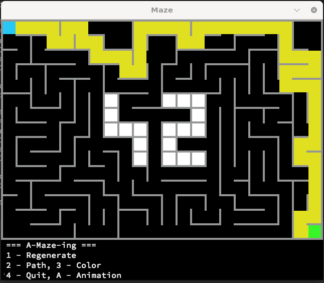

*This project has been created as part of the 42 curriculum by obachuri and jtruckse.*

---

# A-Maze-ing

This project is part of the 42.fr curriculum.

The task: 
- Create 2d maze with thin wall, 
- Place the "42" pattern in the maze,
- Find the shortest path between enter and exit,
- Show the maze and the shortest path,
- Write the maze and the path in a file. 

Bonus part: 
- Animate maze creation process
- Implement several algorithms of maze creation


## Installation

```bash
make install
```

## Usage

```bash
# Run with default configuration
make run

# Run with your configuration
make run my_config.txt

# Run directly with Python
python3 a_maze_ing.py config.txt
```

## Result


### Configuration File

The configuration file controls the maze generation physics and rules.

```bash
# Width and height of the maze (quantity of cells)
WIDTH=50
HEIGHT=50

# Position of entry/exit points (x,y)
ENTRY=1,14
EXIT=50,14

# Name and path to the output file
OUTPUT_FILE=output.txt

# The perfect maze contains only one path between any two points (True/False)
PERFECT=False

# if it's necessary to set seed for randomizer
# SEED=11

# Size of cells, default value 25 pixels 
# W_CELL_SIZE=25

# Place the "42" pattern in the maze, default value True (True/False)
# INSERT_42=False 

# Algorithm to generate maze
# ALGORITHM=PIRMS / DFS (Default - PIRMS)
# DFS - Depth First Search
# PIRMS - Prim's algorithm
#
# ALGORITHM=PIRMS
```

## Requirements

- Linux with desktop environments (tested on Ubuntu and Debian)
- Python 3.10 or later
- Pydantic
- Dotenv

## Maze creation Algorythm: 

For this project we implemented two maze generation algorithms:

- Depth First Search (DFS)
DFS works by exploring one path as far as possible before backtracking. It creates long corridors and deep maze structures.

- Prim’s Algorithm
Prim’s algorithm builds the maze by randomly expanding from a frontier of cells, which results in more branching paths and a more balanced maze.

### Why These Algorythms

DFS and Prim’s algorithm were chosen because they represent two different strategies for maze generation.

- DFS generates long and deep paths.
- Prim’s algorithm produces more balanced mazes with many branches.

Implementing both algorithms allowed us to compare different maze structures and generation behaviors.

## Resources
Resources DFS 
https://en.wikipedia.org/wiki/Depth-first_search

Resources PRIMS
https://en.wikipedia.org/wiki/Prim%27s_algorithm


### Team Project Management

Team Members

Obachuri
- Project lead
- Main architecture design
- Implementation of the DFS algorithm

Jtruckse
- Implementation of Prim’s algorithm
- Integration and testing
- Documentation and README

### Code Reusebility 

Maze generation and pathfinding was implemented as separate library "MazeGen". 

MazeGen library:
- Maze generation
- Pathfinding
- Read config from file
- Maze data export to file

More about MazeGen library in [README.md](mazegen-source/mazegen/README.md) file of the library.


## License

Part of the 42 curriculum project.
